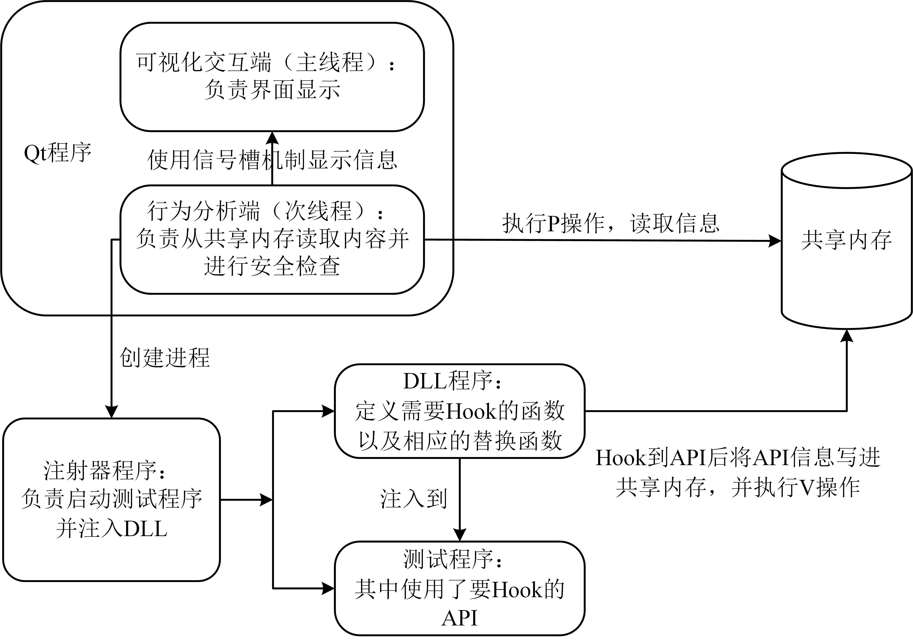
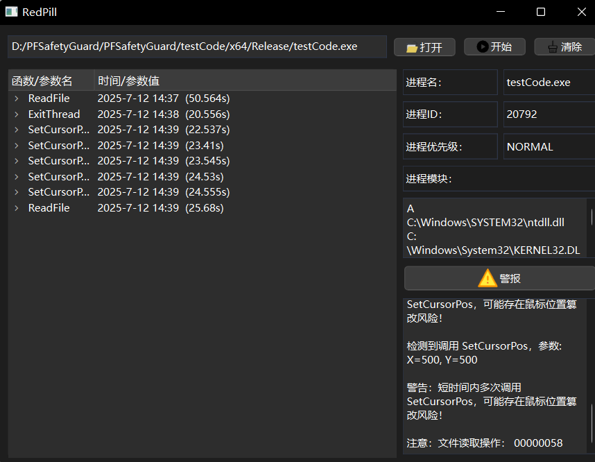
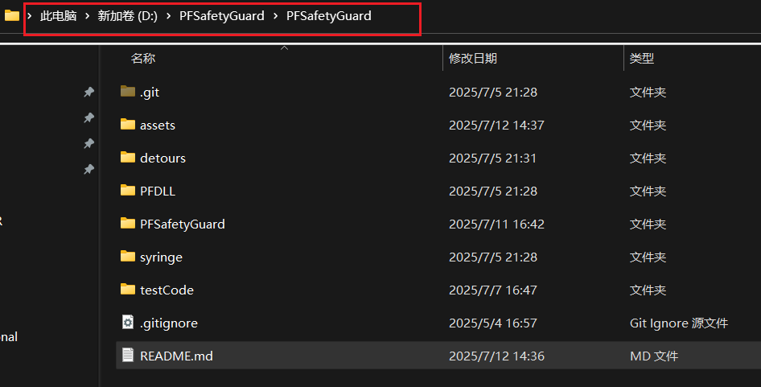
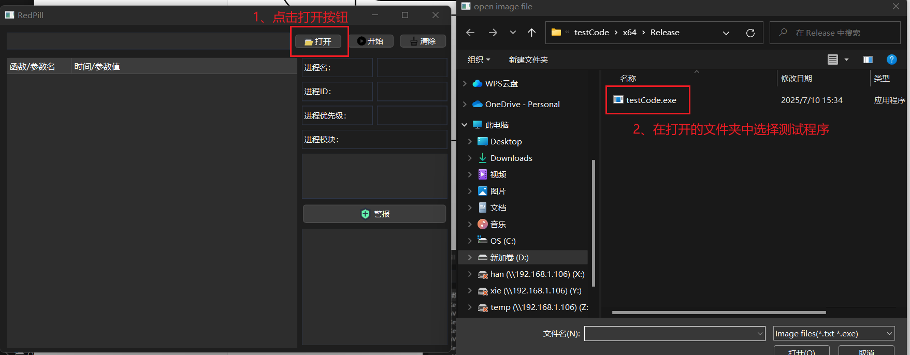
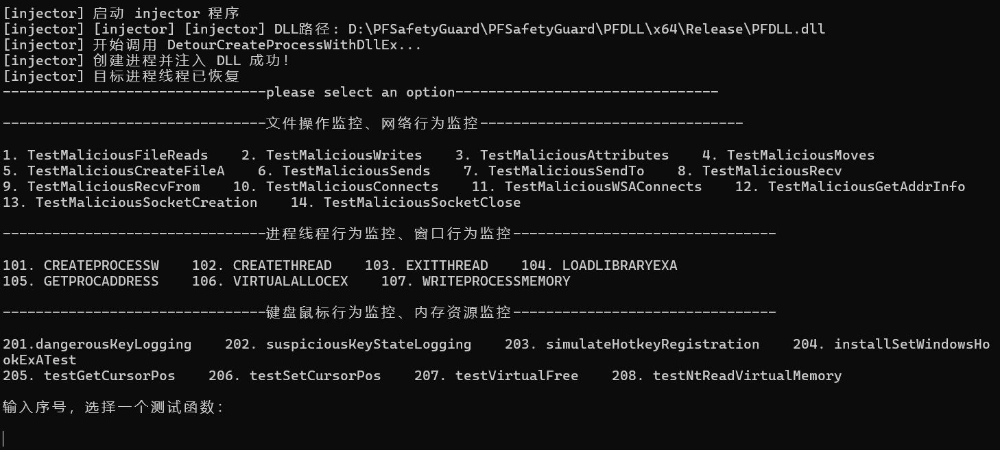
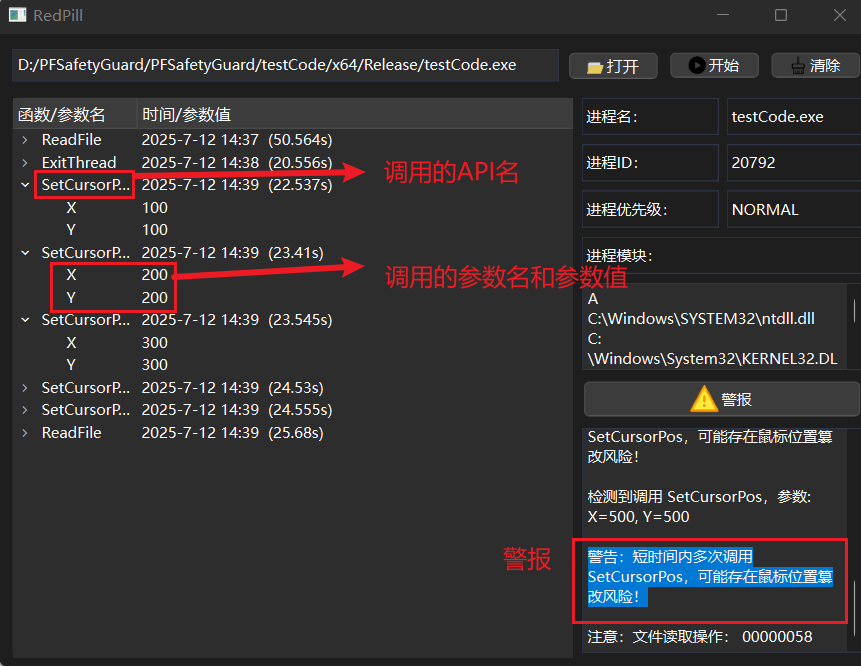

# 东北石油大学软件安全课程设计

PFSafetyGuard（改进版）是一个基于 DLL 注入与 API Hook 的行为监控系统，用于检测 Windows 程序运行过程中的可疑或恶意 API 调用行为。项目通过共享内存通信与可视化界面联动，实现了实时监控与安全预警功能。

## 🌟 项目特点

- 🚀 **DLL 注入技术**：使用 Detours 框架实现对目标程序的 API 拦截。
- 📊 **可视化界面**：基于 Qt 开发，实时展示进程信息、模块信息及 API 调用日志。
- 🧠 **安全检测逻辑**：内置对键盘记录、钩子安装、热键劫持、内存操作等敏感行为的检测规则。
- 🔗 **共享内存通信**：通过信号量与共享内存模块实现注入程序与界面模块的数据交换。

## 📁 项目结构

```
PFSafetyGuard/
├── PFDLL/ # DLL注入模块（Hook API并写入共享内存）
├── syringe/ # 注射器程序（将DLL注入目标进程）
├── testCode/ # 模拟恶意行为的测试程序
├── PFSafetyGuard/ # Qt可视化项目（展示监控数据）
└── README.md # 项目说明文档
```

## 🧩 实现功能

1. 自动注入目标程序并监控其运行过程；
2. 实时记录并显示敏感 API 的调用（如：GetAsyncKeyState、SetWindowsHookExA 等）；
3. 对典型恶意行为发出警报提示（如键盘监听、热键注册、内存访问等）；
4. 支持查看目标进程模块、进程 ID、优先级等基本信息；
5. 安全检测策略可拓展，具备一定的可维护性和可移植性。

## 🧪 测试用例举例

通过模拟程序触发以下 API，测试系统的检测能力：

- `GetAsyncKeyState`, `GetKeyState`：模拟键盘记录器；
- `RegisterHotKey`：模拟快捷键劫持行为；
- `SetWindowsHookExA`：模拟钩子注入；
- `GetCursorPos`, `SetCursorPos`：鼠标行为监控；
- `VirtualFree`, `NtReadVirtualMemory`：模拟内存操作行为。

## 📷 截图预览





## 🔧 编译说明

本项目使用 Visual Studio + Qt 开发，依赖项如下：

- Qt 16.0.1
- Detours （微软开源 DLL Hook 库，已在项目中）
- Windows SDK

建议使用 **Release 模式**进行编译，确保各模块路径正确配置（DLL 路径、注射器路径等）。

## 🌟 操作说明

请将项目克隆到D盘根目录，即确保是这样的目录结构：



这样就不需要再改变其他设置即可运行程序。



随后点击开始按钮，打开测试程序：



选择一个恶意函数的序号，该工具会记录调用的Windows API的参数并在检查后给出警报：



一些有关网络的测试函数操作起来较为复杂，请参考：[测试过程中注意的问题](https://github.com/yaowenda/Study-Notes/blob/master/%E8%BD%AF%E4%BB%B6%E5%AE%89%E5%85%A8%E3%80%81%E9%80%86%E5%90%91/%E8%AF%BE%E7%A8%8B%E8%AE%BE%E8%AE%A1/20250707_%E6%B5%8B%E8%AF%95%E5%87%BD%E6%95%B0%E6%B3%A8%E6%84%8F%E4%BA%8B%E9%A1%B9.md)

## 💡 后续改进方向

- 增加更多 API 的 Hook 支持；
- 引入规则引擎，支持用户自定义安全策略；
- 提供更友好的界面交互体验；
- 将日志导出功能扩展为报告生成。

## 📜 许可证

本项目仅用于课程设计与学习研究目的，不可用于非法用途。

---

**作者：**  | 东北石油大学 · 网络空间安全专业 · YWD SLT WB  
**邮箱：** _1046748784@qq.com_  
**最后更新：** 2025年7月13日
